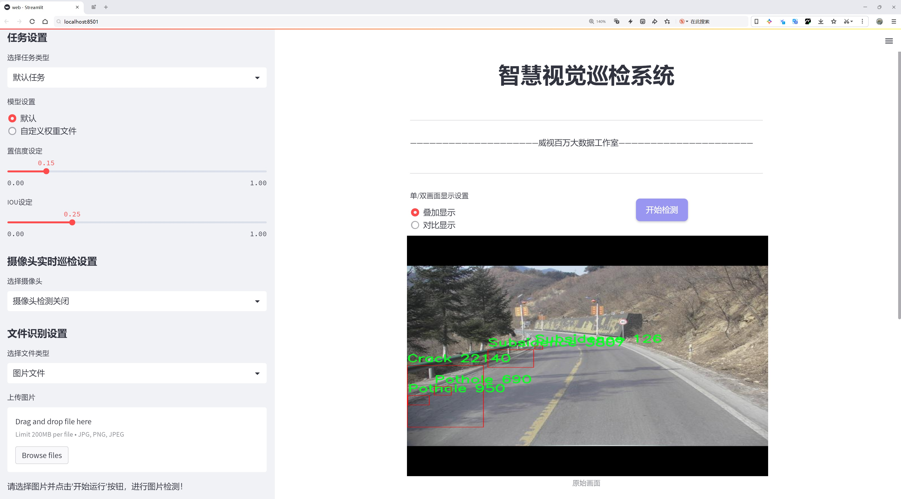
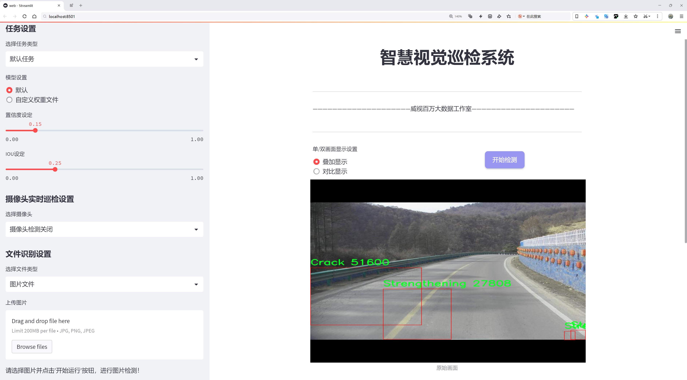
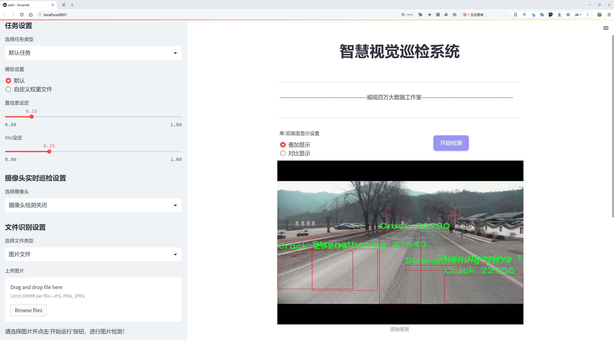
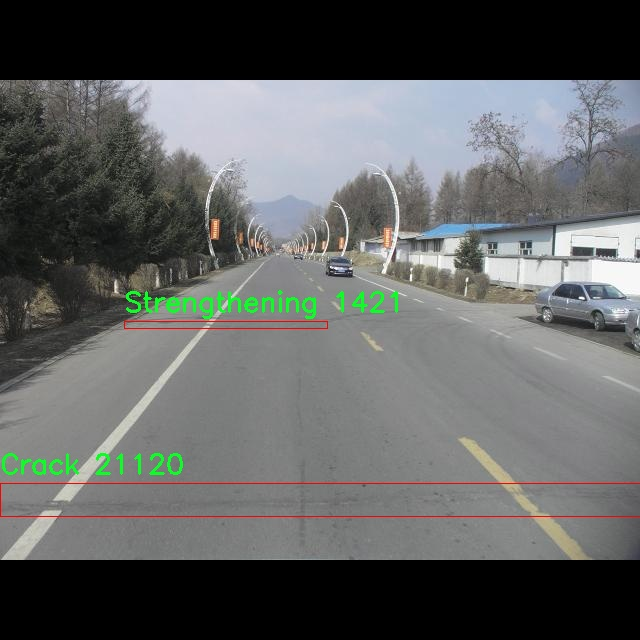
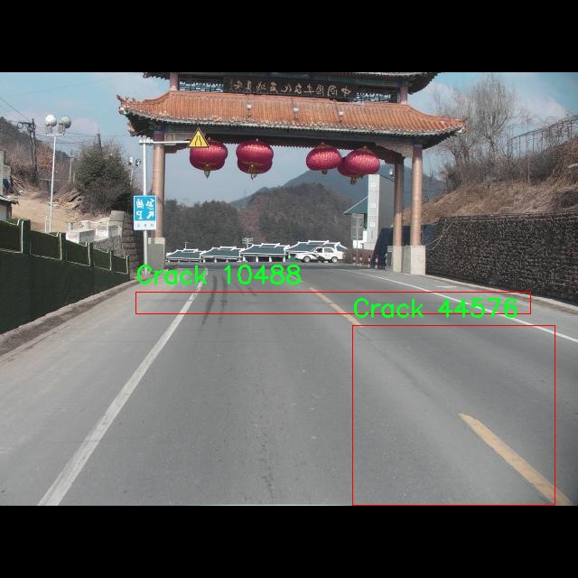
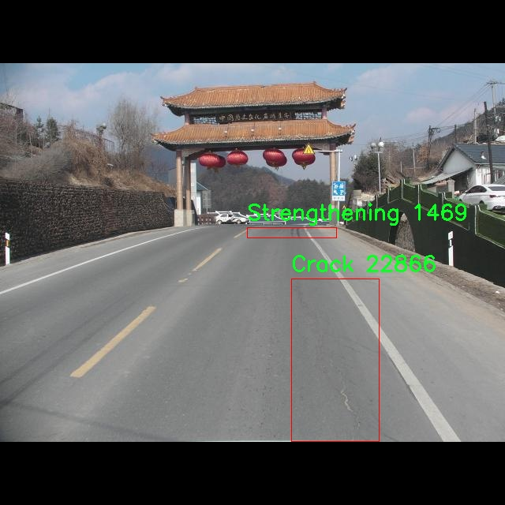
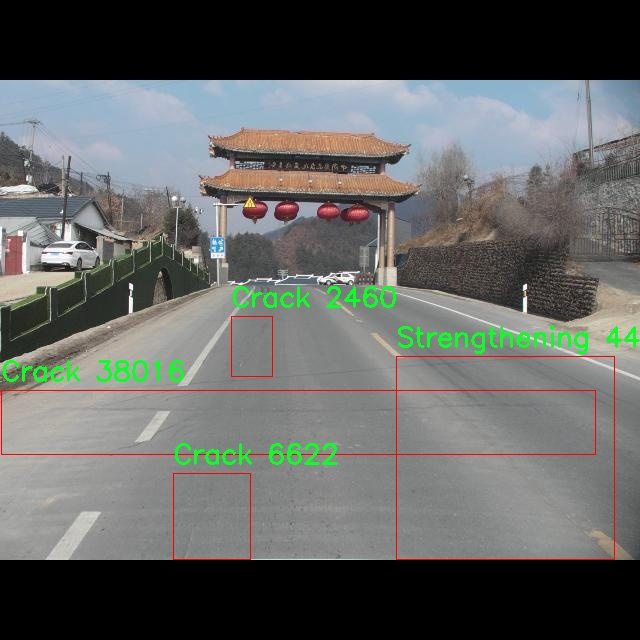
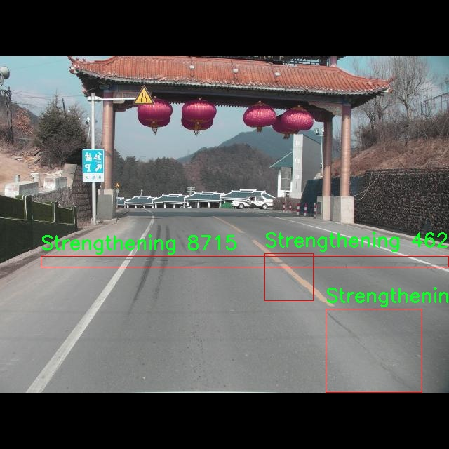

# 道路损坏检测系统源码分享
 # [一条龙教学YOLOV8标注好的数据集一键训练_70+全套改进创新点发刊_Web前端展示]

### 1.研究背景与意义

项目参考[AAAI Association for the Advancement of Artificial Intelligence](https://gitee.com/qunmasj/projects)

项目来源[AACV Association for the Advancement of Computer Vision](https://kdocs.cn/l/cszuIiCKVNis)

研究背景与意义

随着城市化进程的加快，交通基础设施的建设与维护已成为现代城市发展的重要组成部分。道路作为城市交通的主要枢纽，其质量直接影响到人们的出行安全和生活质量。然而，随着时间的推移和交通负荷的增加，道路损坏问题日益严重，常见的损坏类型包括裂缝、松动、坑洞、车辙、沉降等。这些问题不仅影响道路的使用寿命，还可能导致交通事故的发生，给社会带来巨大的经济损失。因此，及时、准确地检测和评估道路损坏情况，对于道路维护和管理具有重要的现实意义。

传统的道路损坏检测方法主要依赖人工巡查和目视检查，这种方法不仅耗时耗力，而且受主观因素影响较大，容易漏检或误判。随着计算机视觉和深度学习技术的迅猛发展，基于图像处理的自动化检测方法逐渐成为研究热点。YOLO（You Only Look Once）系列模型因其高效的实时目标检测能力，已被广泛应用于各种场景的物体识别任务中。YOLOv8作为该系列的最新版本，具备更强的特征提取能力和更快的推理速度，为道路损坏检测提供了新的技术路径。

本研究旨在基于改进的YOLOv8模型，构建一个高效的道路损坏检测系统。我们将使用“china Dataset”数据集，该数据集包含4300张标注图像，涵盖18种不同的道路损坏类别，包括裂缝、松动、坑洞、车辙等。这些类别的细分不仅有助于提高检测的准确性，还能为后续的道路维修提供更为详细的参考依据。通过对该数据集的深入分析与模型训练，我们期望能够实现对各种道路损坏类型的精准识别，从而为道路管理部门提供科学的数据支持。

本研究的意义在于，不仅能够提升道路损坏检测的自动化水平，减少人工检查的工作量，还能提高检测的准确性和及时性。通过改进YOLOv8模型，我们将探索其在复杂环境下的表现，尤其是在不同光照、天气条件下的鲁棒性。这将为未来智能交通系统的建设提供理论依据和技术支持。此外，研究成果有望推动相关领域的技术进步，为其他类型的目标检测任务提供借鉴。

综上所述，基于改进YOLOv8的道路损坏检测系统的研究，不仅具有重要的学术价值，也具有广泛的应用前景。通过该系统的实现，我们希望能够为城市道路的安全管理提供有效的解决方案，促进城市交通基础设施的可持续发展。

### 2.图片演示







##### 注意：由于此博客编辑较早，上面“2.图片演示”和“3.视频演示”展示的系统图片或者视频可能为老版本，新版本在老版本的基础上升级如下：（实际效果以升级的新版本为准）

  （1）适配了YOLOV8的“目标检测”模型和“实例分割”模型，通过加载相应的权重（.pt）文件即可自适应加载模型。

  （2）支持“图片识别”、“视频识别”、“摄像头实时识别”三种识别模式。

  （3）支持“图片识别”、“视频识别”、“摄像头实时识别”三种识别结果保存导出，解决手动导出（容易卡顿出现爆内存）存在的问题，识别完自动保存结果并导出到tempDir中。

  （4）支持Web前端系统中的标题、背景图等自定义修改，后面提供修改教程。

  另外本项目提供训练的数据集和训练教程,暂不提供权重文件（best.pt）,需要您按照教程进行训练后实现图片演示和Web前端界面演示的效果。

### 3.视频演示

[3.1 视频演示](https://www.bilibili.com/video/BV1Gw2KYfELg/)

### 4.数据集信息展示

##### 4.1 本项目数据集详细数据（类别数＆类别名）

nc: 5
names: ['Crack', 'Looseness', 'Pothole', 'Strengthening', 'Subsidence']


##### 4.2 本项目数据集信息介绍

数据集信息展示

在现代交通基础设施的维护与管理中，道路损坏检测系统的有效性直接影响到公共安全和交通效率。为此，针对道路损坏检测的深度学习模型的训练，特别是改进YOLOv8模型，我们构建了一个名为“china Dataset”的数据集。该数据集专门设计用于识别和分类不同类型的道路损坏，以提高检测的准确性和实时性。

“china Dataset”包含五个主要类别，分别是“Crack”（裂缝）、“Looseness”（松动）、“Pothole”（坑洞）、“Strengthening”（加固）和“Subsidence”（沉降）。这些类别涵盖了道路损坏的主要表现形式，能够有效地反映出道路在使用过程中可能出现的各种问题。每个类别的样本均经过精心挑选，确保数据的多样性和代表性，从而为模型的训练提供坚实的基础。

在数据集的构建过程中，我们收集了来自不同地区和不同环境条件下的道路图像。这些图像不仅包括城市道路，还涵盖了乡村道路和高速公路，确保模型在各种场景下的适应性。每张图像都经过标注，明确指出损坏的类型和位置，这为YOLOv8模型的训练提供了丰富的监督信息。标注过程遵循严格的标准，确保每个样本的准确性，以便模型能够学习到有效的特征。

数据集的规模也是其重要特征之一。我们确保“china Dataset”拥有足够的样本量，以便于模型的训练和验证。通过多样化的样本，模型能够更好地学习到不同类型损坏的特征，从而在实际应用中具备更强的泛化能力。此外，数据集中还包含了不同光照、天气和拍摄角度下的图像，这进一步增强了模型在复杂环境中的鲁棒性。

在进行模型训练时，我们采用了数据增强技术，以进一步提升模型的性能。通过对图像进行旋转、缩放、裁剪和颜色调整等操作，我们能够有效地扩展数据集，增加模型的训练样本数量。这种方法不仅提高了模型的准确性，还增强了其对新环境的适应能力。

通过“china Dataset”的训练，我们期望能够显著提高YOLOv8在道路损坏检测中的表现，使其能够快速、准确地识别出各种类型的道路损坏。这将为道路维护提供重要的技术支持，帮助相关部门及时发现和处理道路问题，确保交通安全和畅通。未来，我们还计划不断更新和扩展数据集，以适应道路损坏检测技术的不断发展和变化，为智能交通系统的建设贡献力量。











### 5.全套项目环境部署视频教程（零基础手把手教学）

[5.1 环境部署教程链接（零基础手把手教学）](https://www.ixigua.com/7404473917358506534?logTag=c807d0cbc21c0ef59de5)


[5.2 安装Python虚拟环境创建和依赖库安装视频教程链接（零基础手把手教学）](https://www.ixigua.com/7404474678003106304?logTag=1f1041108cd1f708b01a)

### 6.手把手YOLOV8训练视频教程（零基础小白有手就能学会）

[6.1 手把手YOLOV8训练视频教程（零基础小白有手就能学会）](https://www.ixigua.com/7404477157818401292?logTag=d31a2dfd1983c9668658)


按照上面的训练视频教程链接加载项目提供的数据集，运行train.py即可开始训练



     Epoch   gpu_mem       box       obj       cls    labels  img_size
     1/200     20.8G   0.01576   0.01955  0.007536        22      1280: 100%|██████████| 849/849 [14:42<00:00,  1.04s/it]
               Class     Images     Labels          P          R     mAP@.5 mAP@.5:.95: 100%|██████████| 213/213 [01:14<00:00,  2.87it/s]
                 all       3395      17314      0.994      0.957      0.0957      0.0843

     Epoch   gpu_mem       box       obj       cls    labels  img_size
     2/200     20.8G   0.01578   0.01923  0.007006        22      1280: 100%|██████████| 849/849 [14:44<00:00,  1.04s/it]
               Class     Images     Labels          P          R     mAP@.5 mAP@.5:.95: 100%|██████████| 213/213 [01:12<00:00,  2.95it/s]
                 all       3395      17314      0.996      0.956      0.0957      0.0845

     Epoch   gpu_mem       box       obj       cls    labels  img_size
     3/200     20.8G   0.01561    0.0191  0.006895        27      1280: 100%|██████████| 849/849 [10:56<00:00,  1.29it/s]
               Class     Images     Labels          P          R     mAP@.5 mAP@.5:.95: 100%|███████   | 187/213 [00:52<00:00,  4.04it/s]
                 all       3395      17314      0.996      0.957      0.0957      0.0845


### 7.70+种全套YOLOV8创新点代码加载调参视频教程（一键加载写好的改进模型的配置文件）

[7.1 70+种全套YOLOV8创新点代码加载调参视频教程（一键加载写好的改进模型的配置文件）](https://www.ixigua.com/7404478314661806627?logTag=29066f8288e3f4eea3a4)

### 8.70+种全套YOLOV8创新点原理讲解（非科班也可以轻松写刊发刊，V10版本正在科研待更新）

#### 由于篇幅限制，每个创新点的具体原理讲解就不一一展开，具体见下列网址中的创新点对应子项目的技术原理博客网址【Blog】：


[8.1 70+种全套YOLOV8创新点原理讲解链接](https://gitee.com/qunmasj/good)

#### 部分改进原理讲解(完整的改进原理见上图和技术博客链接)【如果此小节的图加载失败可以通过CSDN或者Github搜索该博客的标题访问原始博客，原始博客图片显示正常】

### Gold-YOLO简介
YOLO再升级：华为诺亚提出Gold-YOLO，聚集-分发机制打造新SOTA
在过去的几年中，YOLO系列模型已经成为实时目标检测领域的领先方法。许多研究通过修改架构、增加数据和设计新的损失函数，将基线推向了更高的水平。然而以前的模型仍然存在信息融合问题，尽管特征金字塔网络（FPN）和路径聚合网络（PANet）已经在一定程度上缓解了这个问题。因此，本研究提出了一种先进的聚集和分发机制（GD机制），该机制通过卷积和自注意力操作实现。这种新设计的模型被称为Gold-YOLO，它提升了多尺度特征融合能力，在所有模型尺度上实现了延迟和准确性的理想平衡。此外，本文首次在YOLO系列中实现了MAE风格的预训练，使得YOLO系列模型能够从无监督预训练中受益。Gold-YOLO-N在COCO val2017数据集上实现了出色的39.9% AP，并在T4 GPU上实现了1030 FPS，超过了之前的SOTA模型YOLOv6-3.0-N，其FPS相似，但性能提升了2.4%。


#### Gold-YOLO


YOLO系列的中间层结构采用了传统的FPN结构，其中包含多个分支用于多尺度特征融合。然而，它只充分融合来自相邻级别的特征，对于其他层次的信息只能间接地进行“递归”获取。

传统的FPN结构在信息传输过程中存在丢失大量信息的问题。这是因为层之间的信息交互仅限于中间层选择的信息，未被选择的信息在传输过程中被丢弃。这种情况导致某个Level的信息只能充分辅助相邻层，而对其他全局层的帮助较弱。因此，整体上信息融合的有效性可能受到限制。
为了避免在传输过程中丢失信息，本文采用了一种新颖的“聚集和分发”机制（GD），放弃了原始的递归方法。该机制使用一个统一的模块来收集和融合所有Level的信息，并将其分发到不同的Level。通过这种方式，作者不仅避免了传统FPN结构固有的信息丢失问题，还增强了中间层的部分信息融合能力，而且并没有显著增加延迟。


# 8.低阶聚合和分发分支 Low-stage gather-and-distribute branch
从主干网络中选择输出的B2、B3、B4、B5特征进行融合，以获取保留小目标信息的高分辨率特征。


低阶特征对齐模块 (Low-stage feature alignment module)： 在低阶特征对齐模块（Low-FAM）中，采用平均池化（AvgPool）操作对输入特征进行下采样，以实现统一的大小。通过将特征调整为组中最小的特征大小（ R B 4 = 1 / 4 R ） （R_{B4} = 1/4R）（R 
B4 =1/4R），我们得到对齐后的特征F a l i g n F_{align}F align 。低阶特征对齐技术确保了信息的高效聚合，同时通过变换器模块来最小化后续处理的计算复杂性。其中选择 R B 4 R_{B4}R B4 作为特征对齐的目标大小主要基于保留更多的低层信息的同时不会带来较大的计算延迟。
低阶信息融合模块(Low-stage information fusion module)： 低阶信息融合模块（Low-IFM）设计包括多层重新参数化卷积块（RepBlock）和分裂操作。具体而言，RepBlock以F a l i g n ( c h a n n e l = s u m ( C B 2 ， C B 3 ， C B 4 ， C B 5 ) ) F_{align} (channel= sum(C_{B2}，C_{B3}，C_{B4}，C_{B5}))F align (channel=sum(C B2 ，C B3 ，C B4 ，C B5 )作为输入，并生成F f u s e ( c h a n n e l = C B 4 + C B 5 ) F_{fuse} (channel= C_{B4} + C_{B5})F fuse (channel=C B4 +C B5 )。其中中间通道是一个可调整的值（例如256），以适应不同的模型大小。由RepBlock生成的特征随后在通道维度上分裂为F i n j P 3 Finj_P3Finj P 3和F i n j P 4 Finj_P4Finj P 4，然后与不同级别的特征进行融合。


# 8.高阶聚合和分发分支 High-stage gather-and-distribute branch
高级全局特征对齐模块（High-GD）将由低级全局特征对齐模块（Low-GD）生成的特征{P3, P4, P5}进行融合。


高级特征对齐模块(High-stage feature alignment module)： High-FAM由avgpool组成，用于将输入特征的维度减小到统一的尺寸。具体而言，当输入特征的尺寸为{R P 3 R_{P3}R P3 , R P 4 R_{P4}R P4 , R P 5 R_{P 5}R P5 }时，avgpool将特征尺寸减小到该特征组中最小的尺寸（R P 5 R_{P5}R P5  = 1/8R）。由于transformer模块提取了高层次的信息，池化操作有助于信息聚合，同时降低了transformer模块后续步骤的计算需求。

Transformer融合模块由多个堆叠的transformer组成，transformer块的数量为L。每个transformer块包括一个多头注意力块、一个前馈网络（FFN）和残差连接。采用与LeViT相同的设置来配置多头注意力块，使用16个通道作为键K和查询Q的头维度，32个通道作为值V的头维度。为了加速推理过程，将层归一化操作替换为批归一化，并将所有的GELU激活函数替换为ReLU。为了增强变换器块的局部连接，在两个1x1卷积层之间添加了一个深度卷积层。同时，将FFN的扩展因子设置为2，以在速度和计算成本之间取得平衡。

信息注入模块(Information injection module)： 高级全局特征对齐模块（High-GD）中的信息注入模块与低级全局特征对齐模块（Low-GD）中的相同。在高级阶段，局部特征（Flocal）等于Pi，因此公式如下所示：


### 增强的跨层信息流动 Enhanced cross-layer information flow
为了进一步提升性能，从YOLOv8 中的PAFPN模块中得到启发，引入了Inject-LAF模块。该模块是注入模块的增强版，包括了一个轻量级相邻层融合（LAF）模块，该模块被添加到注入模块的输入位置。为了在速度和准确性之间取得平衡，设计了两个LAF模型：LAF低级模型和LAF高级模型，分别用于低级注入（合并相邻两层的特征）和高级注入（合并相邻一层的特征）。它们的结构如图5(b)所示。为了确保来自不同层级的特征图与目标大小对齐，在实现中的两个LAF模型仅使用了三个操作符：双线性插值（上采样过小的特征）、平均池化（下采样过大的特征）和1x1卷积（调整与目标通道不同的特征）。模型中的LAF模块与信息注入模块的结合有效地平衡了准确性和速度之间的关系。通过使用简化的操作，能够增加不同层级之间的信息流路径数量，从而提高性能而不显著增加延迟。


### 9.系统功能展示（检测对象为举例，实际内容以本项目数据集为准）

图9.1.系统支持检测结果表格显示

  图9.2.系统支持置信度和IOU阈值手动调节

  图9.3.系统支持自定义加载权重文件best.pt(需要你通过步骤5中训练获得)

  图9.4.系统支持摄像头实时识别

  图9.5.系统支持图片识别

  图9.6.系统支持视频识别

  图9.7.系统支持识别结果文件自动保存

  图9.8.系统支持Excel导出检测结果数据


### 10.原始YOLOV8算法原理

原始YOLOv8算法原理

YOLOv8是由Ultralytics公司于2023年推出的最新目标检测算法，作为YOLO系列的第八个版本，它在设计和性能上都进行了显著的改进。YOLOv8的核心理念是实现高效的实时目标检测，兼顾精度和速度，以满足日益增长的应用需求。该算法的架构由多个模块组成，包括输入层、主干网络、颈部网络和头部网络，每个模块在整体性能中扮演着重要角色。

在YOLOv8中，主干网络采用了CSP（Cross Stage Partial）结构，这一设计理念旨在通过特征提取的分离来提升模型的表现。CSP结构将特征提取过程分为两部分，分别进行卷积和连接，从而在保留特征信息的同时，减少了计算复杂度。C2f模块的引入则是YOLOv8的一大创新，它替代了YOLOv5中的C3模块，通过跨层分支连接的方式增强了模型的梯度流。这种设计不仅提高了特征提取的效率，还改善了模型在复杂场景下的检测能力。

在主干网络的末尾，YOLOv8引入了SPPF（Spatial Pyramid Pooling Fast）模块，通过三个最大池化层的组合，进一步增强了模型对多尺度特征的处理能力。这一设计使得YOLOv8能够在不同尺寸的目标检测中表现出色，适应性更强。此外，SPPF模块还提升了模型的计算速度，使得YOLOv8在实时应用中更具优势。

颈部网络采用了PAN-FPN（Path Aggregation Network - Feature Pyramid Network）结构，旨在实现特征的多尺度融合。PAN-FPN通过自底向上的路径聚合特征，结合自顶向下的特征传播，确保了不同尺度特征图的信息能够有效传递。这种特征融合的方式，使得YOLOv8在处理复杂场景时，能够更好地捕捉到目标的上下文信息，从而提高检测的准确性。

YOLOv8的检测网络采用了Anchor-Free的检测方式，这一创新使得模型在处理目标时不再依赖于预定义的锚框，从而简化了模型的设计。Detect模块中使用的解耦头结构，进一步优化了目标检测的过程。通过两个并行的卷积分支，YOLOv8能够分别计算回归和类别的损失，这种解耦设计不仅提高了模型的训练效率，还使得最终的检测结果更加精确。

在损失函数方面，YOLOv8采用了CloU（Class Loss Uncertainty）损失函数，这一损失函数通过引入不确定性度量，能够更好地处理类别不平衡的问题，从而提升模型在复杂场景下的鲁棒性。CloU损失函数的设计考虑到了目标检测中的各种挑战，使得YOLOv8在面对多样化的目标时，依然能够保持高效的检测性能。

YOLOv8的模型设置灵活多样，提供了多个版本（如YOLOv8n、YOLOv8s、YOLOv8m等），以适应不同的应用场景和硬件条件。通过调整depth_factor、width_factor和ratio等参数，用户可以根据需求定制模型的深度和宽度。这种灵活性使得YOLOv8不仅适用于高性能计算环境，也能够在资源受限的设备上运行，展现出广泛的适用性。

综上所述，YOLOv8在设计上融合了多种先进的技术，通过CSP结构、C2f模块、SPPF模块、PAN-FPN结构以及解耦头等创新，使得该算法在目标检测领域取得了显著的进展。其高效的特征提取和融合能力、灵活的模型设置以及先进的损失函数设计，使得YOLOv8成为当前业界最流行和成功的目标检测算法之一。随着YOLOv8的不断发展和应用，其在智能监控、自动驾驶、无人机等领域的潜力将会得到进一步的挖掘和发挥。


### 11.项目核心源码讲解（再也不用担心看不懂代码逻辑）

#### 11.1 70+种YOLOv8算法改进源码大全和调试加载训练教程（非必要）\ultralytics\models\yolo\pose\val.py

以下是对给定代码的核心部分进行分析和详细注释的结果。保留了与姿态估计相关的主要功能，并进行了中文注释。

```python
# Ultralytics YOLO 🚀, AGPL-3.0 license

from pathlib import Path
import numpy as np
import torch
from ultralytics.models.yolo.detect import DetectionValidator
from ultralytics.utils import LOGGER, ops
from ultralytics.utils.metrics import PoseMetrics, box_iou, kpt_iou
from ultralytics.utils.plotting import output_to_target, plot_images

class PoseValidator(DetectionValidator):
    """
    PoseValidator类，继承自DetectionValidator类，用于基于姿态模型的验证。
    """

    def __init__(self, dataloader=None, save_dir=None, pbar=None, args=None, _callbacks=None):
        """初始化PoseValidator对象，设置自定义参数和属性。"""
        super().__init__(dataloader, save_dir, pbar, args, _callbacks)
        self.sigma = None  # 用于计算关键点的sigma值
        self.kpt_shape = None  # 关键点的形状
        self.args.task = 'pose'  # 设置任务类型为姿态估计
        self.metrics = PoseMetrics(save_dir=self.save_dir, on_plot=self.on_plot)  # 初始化姿态度量
        if isinstance(self.args.device, str) and self.args.device.lower() == 'mps':
            LOGGER.warning("WARNING ⚠️ Apple MPS known Pose bug. Recommend 'device=cpu' for Pose models.")

    def preprocess(self, batch):
        """预处理批次数据，将关键点数据转换为浮点数并移动到设备上。"""
        batch = super().preprocess(batch)  # 调用父类的预处理方法
        batch['keypoints'] = batch['keypoints'].to(self.device).float()  # 将关键点数据转换为浮点数并移动到指定设备
        return batch

    def postprocess(self, preds):
        """应用非极大值抑制，返回高置信度的检测结果。"""
        return ops.non_max_suppression(preds,
                                       self.args.conf,
                                       self.args.iou,
                                       labels=self.lb,
                                       multi_label=True,
                                       agnostic=self.args.single_cls,
                                       max_det=self.args.max_det,
                                       nc=self.nc)

    def init_metrics(self, model):
        """初始化YOLO模型的姿态估计度量。"""
        super().init_metrics(model)  # 调用父类的初始化方法
        self.kpt_shape = self.data['kpt_shape']  # 获取关键点的形状
        is_pose = self.kpt_shape == [17, 3]  # 判断是否为姿态估计
        nkpt = self.kpt_shape[0]  # 关键点数量
        self.sigma = OKS_SIGMA if is_pose else np.ones(nkpt) / nkpt  # 设置sigma值

    def update_metrics(self, preds, batch):
        """更新度量指标。"""
        for si, pred in enumerate(preds):
            idx = batch['batch_idx'] == si  # 获取当前批次的索引
            cls = batch['cls'][idx]  # 获取当前批次的类别
            bbox = batch['bboxes'][idx]  # 获取当前批次的边界框
            kpts = batch['keypoints'][idx]  # 获取当前批次的关键点
            nl, npr = cls.shape[0], pred.shape[0]  # 标签数量和预测数量
            nk = kpts.shape[1]  # 关键点数量
            shape = batch['ori_shape'][si]  # 原始图像的形状
            correct_kpts = torch.zeros(npr, self.niou, dtype=torch.bool, device=self.device)  # 初始化正确的关键点
            correct_bboxes = torch.zeros(npr, self.niou, dtype=torch.bool, device=self.device)  # 初始化正确的边界框
            self.seen += 1  # 更新已处理的样本数量

            if npr == 0:  # 如果没有预测结果
                if nl:
                    self.stats.append((correct_bboxes, correct_kpts, *torch.zeros((2, 0), device=self.device), cls.squeeze(-1)))
                continue

            # 处理预测结果
            predn = pred.clone()  # 克隆预测结果
            ops.scale_boxes(batch['img'][si].shape[1:], predn[:, :4], shape, ratio_pad=batch['ratio_pad'][si])  # 缩放边界框
            pred_kpts = predn[:, 6:].view(npr, nk, -1)  # 获取预测的关键点
            ops.scale_coords(batch['img'][si].shape[1:], pred_kpts, shape, ratio_pad=batch['ratio_pad'][si])  # 缩放关键点坐标

            # 评估
            if nl:
                height, width = batch['img'].shape[2:]  # 获取图像的高度和宽度
                tbox = ops.xywh2xyxy(bbox) * torch.tensor((width, height, width, height), device=self.device)  # 目标边界框
                ops.scale_boxes(batch['img'][si].shape[1:], tbox, shape, ratio_pad=batch['ratio_pad'][si])  # 缩放目标边界框
                tkpts = kpts.clone()  # 克隆关键点
                tkpts[..., 0] *= width  # 缩放x坐标
                tkpts[..., 1] *= height  # 缩放y坐标
                tkpts = ops.scale_coords(batch['img'][si].shape[1:], tkpts, shape, ratio_pad=batch['ratio_pad'][si])  # 缩放关键点坐标
                labelsn = torch.cat((cls, tbox), 1)  # 合并类别和边界框
                correct_bboxes = self._process_batch(predn[:, :6], labelsn)  # 处理边界框
                correct_kpts = self._process_batch(predn[:, :6], labelsn, pred_kpts, tkpts)  # 处理关键点

            # 记录正确的边界框和关键点
            self.stats.append((correct_bboxes, correct_kpts, pred[:, 4], pred[:, 5], cls.squeeze(-1)))

    def _process_batch(self, detections, labels, pred_kpts=None, gt_kpts=None):
        """
        返回正确的预测矩阵。

        参数:
            detections (torch.Tensor): 形状为[N, 6]的检测结果张量。
            labels (torch.Tensor): 形状为[M, 5]的标签张量。
            pred_kpts (torch.Tensor, 可选): 形状为[N, 51]的预测关键点张量。
            gt_kpts (torch.Tensor, 可选): 形状为[N, 51]的真实关键点张量。

        返回:
            torch.Tensor: 形状为[N, 10]的正确预测矩阵。
        """
        if pred_kpts is not None and gt_kpts is not None:
            area = ops.xyxy2xywh(labels[:, 1:])[:, 2:].prod(1) * 0.53  # 计算区域
            iou = kpt_iou(gt_kpts, pred_kpts, sigma=self.sigma, area=area)  # 计算关键点的IoU
        else:  # 处理边界框
            iou = box_iou(labels[:, 1:], detections[:, :4])  # 计算边界框的IoU

        return self.match_predictions(detections[:, 5], labels[:, 0], iou)  # 匹配预测结果

    def plot_val_samples(self, batch, ni):
        """绘制并保存验证集样本，包括预测的边界框和关键点。"""
        plot_images(batch['img'],
                    batch['batch_idx'],
                    batch['cls'].squeeze(-1),
                    batch['bboxes'],
                    kpts=batch['keypoints'],
                    paths=batch['im_file'],
                    fname=self.save_dir / f'val_batch{ni}_labels.jpg',
                    names=self.names,
                    on_plot=self.on_plot)

    def pred_to_json(self, predn, filename):
        """将YOLO预测结果转换为COCO JSON格式。"""
        stem = Path(filename).stem
        image_id = int(stem) if stem.isnumeric() else stem  # 获取图像ID
        box = ops.xyxy2xywh(predn[:, :4])  # 转换为xywh格式
        box[:, :2] -= box[:, 2:] / 2  # 将中心坐标转换为左上角坐标
        for p, b in zip(predn.tolist(), box.tolist()):
            self.jdict.append({
                'image_id': image_id,
                'category_id': self.class_map[int(p[5])],
                'bbox': [round(x, 3) for x in b],
                'keypoints': p[6:],
                'score': round(p[4], 5)})

    def eval_json(self, stats):
        """使用COCO JSON格式评估目标检测模型。"""
        if self.args.save_json and self.is_coco and len(self.jdict):
            anno_json = self.data['path'] / 'annotations/person_keypoints_val2017.json'  # 注释文件
            pred_json = self.save_dir / 'predictions.json'  # 预测文件
            LOGGER.info(f'\nEvaluating pycocotools mAP using {pred_json} and {anno_json}...')
            try:
                from pycocotools.coco import COCO  # 导入COCO API
                from pycocotools.cocoeval import COCOeval  # 导入COCO评估工具

                for x in anno_json, pred_json:
                    assert x.is_file(), f'{x} file not found'
                anno = COCO(str(anno_json))  # 初始化注释API
                pred = anno.loadRes(str(pred_json))  # 初始化预测API
                for i, eval in enumerate([COCOeval(anno, pred, 'bbox'), COCOeval(anno, pred, 'keypoints')]):
                    if self.is_coco:
                        eval.params.imgIds = [int(Path(x).stem) for x in self.dataloader.dataset.im_files]  # 设置评估图像
                    eval.evaluate()
                    eval.accumulate()
                    eval.summarize()
                    idx = i * 4 + 2
                    stats[self.metrics.keys[idx + 1]], stats[self.metrics.keys[idx]] = eval.stats[:2]  # 更新mAP
            except Exception as e:
                LOGGER.warning(f'pycocotools unable to run: {e}')
        return stats
```

以上代码保留了与姿态估计相关的主要功能，并对每个方法和重要的代码行进行了详细的中文注释，以便更好地理解其功能和实现。

这个文件是一个用于YOLOv8模型姿态估计验证的Python脚本，主要实现了PoseValidator类，该类继承自DetectionValidator类。PoseValidator类的主要功能是对姿态估计模型的输出进行验证和评估。

在初始化过程中，PoseValidator类会调用父类的构造函数，并设置一些特定于姿态估计的参数，比如sigma和关键点的形状。它还会检查设备类型，如果是Apple的MPS设备，会发出警告，建议使用CPU进行模型推理。

该类的preprocess方法负责对输入的批次数据进行预处理，将关键点数据转换为浮点数并移动到指定设备上。get_desc方法返回评估指标的描述字符串，以便在输出结果时使用。

postprocess方法应用非极大值抑制，返回具有高置信度的检测结果。init_metrics方法用于初始化姿态估计的评估指标，并根据关键点的形状设置sigma值。

update_metrics方法是该类的核心功能之一，它用于更新评估指标。它会遍历每个预测结果，计算与真实标签的匹配情况，并记录正确的边界框和关键点。此方法还处理了保存预测结果到JSON文件的功能。

_process_batch方法用于返回正确的预测矩阵，计算检测结果与标签之间的交并比（IoU），并进行匹配。plot_val_samples和plot_predictions方法用于可视化验证样本和模型预测结果。

最后，pred_to_json方法将YOLO的预测结果转换为COCO格式的JSON文件，而eval_json方法则用于评估模型的性能，计算mAP（平均精度均值）等指标。

整体而言，这个文件提供了姿态估计模型验证的完整流程，包括数据预处理、模型推理、结果评估和可视化，适用于YOLOv8模型的姿态估计任务。

#### 11.2 code\ultralytics\data\explorer\gui\dash.py

以下是经过简化和注释的核心代码部分：

```python
# 导入必要的库
import time
from threading import Thread
import pandas as pd
import streamlit as st
from ultralytics import Explorer
from ultralytics.utils import ROOT, SETTINGS
from ultralytics.utils.checks import check_requirements

# 检查所需的库是否已安装
check_requirements(("streamlit>=1.29.0", "streamlit-select>=0.2"))

def _get_explorer():
    """初始化并返回Explorer类的实例。"""
    # 创建Explorer实例，使用当前会话状态中的数据集和模型
    exp = Explorer(data=st.session_state.get("dataset"), model=st.session_state.get("model"))
    
    # 创建一个线程来生成嵌入表
    thread = Thread(
        target=exp.create_embeddings_table, 
        kwargs={"force": st.session_state.get("force_recreate_embeddings")}
    )
    thread.start()  # 启动线程
    
    # 创建进度条以跟踪嵌入表的创建进度
    progress_bar = st.progress(0, text="Creating embeddings table...")
    while exp.progress < 1:  # 当进度小于100%时，持续更新进度条
        time.sleep(0.1)  # 每0.1秒检查一次进度
        progress_bar.progress(exp.progress, text=f"Progress: {exp.progress * 100}%")
    
    thread.join()  # 等待线程完成
    st.session_state["explorer"] = exp  # 将Explorer实例存储在会话状态中
    progress_bar.empty()  # 清空进度条

def init_explorer_form():
    """初始化Explorer实例并创建嵌入表，带有进度跟踪。"""
    # 获取数据集列表
    datasets = ROOT / "cfg" / "datasets"
    ds = [d.name for d in datasets.glob("*.yaml")]
    
    # 定义可用模型列表
    models = [
        "yolov8n.pt", "yolov8s.pt", "yolov8m.pt", "yolov8l.pt", "yolov8x.pt",
        "yolov8n-seg.pt", "yolov8s-seg.pt", "yolov8m-seg.pt", "yolov8l-seg.pt", "yolov8x-seg.pt",
        "yolov8n-pose.pt", "yolov8s-pose.pt", "yolov8m-pose.pt", "yolov8l-pose.pt", "yolov8x-pose.pt",
    ]
    
    # 创建表单以选择数据集和模型
    with st.form(key="explorer_init_form"):
        col1, col2 = st.columns(2)
        with col1:
            st.selectbox("Select dataset", ds, key="dataset", index=ds.index("coco128.yaml"))
        with col2:
            st.selectbox("Select model", models, key="model")
        st.checkbox("Force recreate embeddings", key="force_recreate_embeddings")
        
        # 提交表单时调用_get_explorer函数
        st.form_submit_button("Explore", on_click=_get_explorer)

def run_sql_query():
    """执行SQL查询并返回结果。"""
    st.session_state["error"] = None  # 清除错误信息
    query = st.session_state.get("query")  # 获取用户输入的查询
    if query.strip():  # 如果查询不为空
        exp = st.session_state["explorer"]  # 获取Explorer实例
        res = exp.sql_query(query, return_type="arrow")  # 执行SQL查询
        st.session_state["imgs"] = res.to_pydict()["im_file"]  # 将结果存储在会话状态中

def layout():
    """设置页面布局并提供文档链接。"""
    st.set_page_config(layout="wide", initial_sidebar_state="collapsed")
    st.markdown("<h1 style='text-align: center;'>Ultralytics Explorer Demo</h1>", unsafe_allow_html=True)

    if st.session_state.get("explorer") is None:  # 如果Explorer实例不存在，初始化表单
        init_explorer_form()
        return

    exp = st.session_state.get("explorer")  # 获取Explorer实例
    imgs = st.session_state.get("imgs") or []  # 获取当前会话中的图像列表
    if st.session_state.get("error"):
        st.error(st.session_state["error"])  # 显示错误信息

    # 显示查询表单
    query_form()

if __name__ == "__main__":
    layout()  # 运行布局函数
```

### 代码说明：
1. **导入库**：导入所需的库，包括`streamlit`用于创建Web应用，`pandas`用于数据处理，`ultralytics`用于YOLO模型的使用。
2. **检查库依赖**：使用`check_requirements`函数确保所需的库已安装。
3. **_get_explorer函数**：初始化`Explorer`类的实例并在后台线程中创建嵌入表，同时更新进度条。
4. **init_explorer_form函数**：创建表单以选择数据集和模型，并在提交时调用`_get_explorer`函数。
5. **run_sql_query函数**：执行用户输入的SQL查询并将结果存储在会话状态中。
6. **layout函数**：设置页面布局，初始化Explorer实例或显示查询表单。

以上代码为Ultralytics Explorer的核心功能，主要涉及数据集和模型的选择、SQL查询的执行以及进度跟踪。

这个程序文件是一个基于Streamlit框架的Web应用，旨在为用户提供一个交互式的界面来探索和查询Ultralytics YOLO模型的数据集。程序的主要功能包括选择数据集和模型、创建嵌入表、执行SQL查询、进行AI查询以及查找相似图像等。

首先，程序导入了一些必要的库，包括时间处理、线程管理、数据处理（pandas）以及Ultralytics的相关模块。它还检查了所需的库是否已安装，确保程序能够正常运行。

程序的核心功能是通过`_get_explorer`函数初始化一个`Explorer`类的实例，并在后台线程中创建嵌入表。这个过程通过进度条向用户展示当前的进度，直到嵌入表创建完成。创建完成后，`Explorer`实例被存储在会话状态中，以便后续使用。

接下来，`init_explorer_form`函数提供了一个表单，允许用户选择数据集和模型。用户可以从预定义的数据集和模型列表中进行选择，并选择是否强制重新创建嵌入。提交表单后，会调用`_get_explorer`函数。

程序还定义了两个查询表单，`query_form`和`ai_query_form`，分别用于执行SQL查询和AI查询。用户可以输入查询条件，提交后将调用相应的查询函数来获取结果，并将结果存储在会话状态中。

`find_similar_imgs`函数用于查找与用户选择的图像相似的图像，结果同样存储在会话状态中。`similarity_form`函数则提供了一个表单，允许用户设置相似图像查询的限制，并提交查询。

在`run_sql_query`和`run_ai_query`函数中，程序执行相应的查询，并处理可能出现的错误情况。如果查询成功，结果将更新到会话状态中。

`reset_explorer`函数用于重置探索器的状态，清空会话中的相关变量。

程序的布局由`layout`函数负责，设置了页面的配置和结构。它首先检查是否已有`Explorer`实例，如果没有，则调用初始化表单。如果已有实例，则显示图像选择、查询表单和相似性搜索表单等。

最后，程序通过`if __name__ == "__main__":`语句运行`layout`函数，启动整个应用。整个程序的设计旨在为用户提供一个友好的界面，以便于探索和查询YOLO模型的数据集，支持多种查询方式和图像处理功能。

#### 11.3 ui.py

以下是保留的核心代码部分，并附上详细的中文注释：

```python
import sys
import subprocess

def run_script(script_path):
    """
    使用当前 Python 环境运行指定的脚本。

    Args:
        script_path (str): 要运行的脚本路径

    Returns:
        None
    """
    # 获取当前 Python 解释器的路径
    python_path = sys.executable

    # 构建运行命令，使用 streamlit 运行指定的脚本
    command = f'"{python_path}" -m streamlit run "{script_path}"'

    # 执行命令
    result = subprocess.run(command, shell=True)
    # 检查命令执行结果，如果返回码不为0，表示执行出错
    if result.returncode != 0:
        print("脚本运行出错。")

# 实例化并运行应用
if __name__ == "__main__":
    # 指定要运行的脚本路径
    script_path = "web.py"  # 假设脚本在当前目录下

    # 调用函数运行脚本
    run_script(script_path)
```

### 注释说明：
1. **导入模块**：
   - `sys`：用于获取当前 Python 解释器的路径。
   - `subprocess`：用于执行外部命令。

2. **`run_script` 函数**：
   - 该函数接受一个脚本路径作为参数，并在当前 Python 环境中运行该脚本。
   - 使用 `sys.executable` 获取当前 Python 解释器的路径，以确保使用正确的 Python 版本。
   - 构建命令字符串，使用 `streamlit` 模块运行指定的脚本。
   - 使用 `subprocess.run` 执行构建的命令，并检查返回码以判断脚本是否成功运行。

3. **主程序块**：
   - 在 `if __name__ == "__main__":` 中，指定要运行的脚本路径（假设为 `web.py`）。
   - 调用 `run_script` 函数来执行指定的脚本。

这个程序文件名为 `ui.py`，主要功能是使用当前的 Python 环境来运行一个指定的脚本，具体是通过 Streamlit 来启动一个 Web 应用。

程序首先导入了必要的模块，包括 `sys`、`os` 和 `subprocess`，这些模块提供了与系统交互的功能。特别是 `subprocess` 模块用于在 Python 中执行外部命令。

接下来，定义了一个名为 `run_script` 的函数，该函数接受一个参数 `script_path`，表示要运行的脚本的路径。在函数内部，首先获取当前 Python 解释器的路径，这通过 `sys.executable` 实现。然后，构建一个命令字符串，该命令用于调用 Streamlit 来运行指定的脚本。命令的格式是 `"{python_path}" -m streamlit run "{script_path}"`，其中 `python_path` 是当前 Python 解释器的路径，`script_path` 是要运行的脚本路径。

接着，使用 `subprocess.run` 方法执行构建好的命令。这个方法会在 shell 中运行命令，并返回一个结果对象。通过检查 `result.returncode`，可以判断脚本是否成功运行。如果返回码不为零，表示运行出错，程序会打印出“脚本运行出错。”的提示信息。

在文件的最后部分，使用 `if __name__ == "__main__":` 语句来确保当这个文件作为主程序运行时，下面的代码才会被执行。在这里，指定了要运行的脚本路径为 `web.py`，这个路径是通过 `abs_path` 函数获取的，确保路径是绝对路径。最后，调用 `run_script` 函数来执行指定的脚本。

总体来说，这个程序的目的是方便用户通过一个简单的界面来启动一个 Streamlit Web 应用，简化了手动输入命令的过程。

#### 11.4 70+种YOLOv8算法改进源码大全和调试加载训练教程（非必要）\ultralytics\utils\callbacks\tensorboard.py

以下是经过简化和注释的核心代码部分，主要用于在训练过程中将数据记录到 TensorBoard 中。

```python
# 导入必要的库
from ultralytics.utils import LOGGER, SETTINGS, TESTS_RUNNING, colorstr

try:
    # 尝试导入 TensorBoard 的 SummaryWriter
    from torch.utils.tensorboard import SummaryWriter

    # 确保当前不是测试运行，并且 TensorBoard 集成已启用
    assert not TESTS_RUNNING  
    assert SETTINGS['tensorboard'] is True  
    WRITER = None  # 初始化 TensorBoard 的 SummaryWriter 实例

except (ImportError, AssertionError, TypeError):
    # 处理导入错误或断言错误
    SummaryWriter = None  # 如果导入失败，则将 SummaryWriter 设置为 None


def _log_scalars(scalars, step=0):
    """将标量值记录到 TensorBoard。"""
    if WRITER:  # 如果 WRITER 已初始化
        for k, v in scalars.items():  # 遍历标量字典
            WRITER.add_scalar(k, v, step)  # 记录每个标量


def on_pretrain_routine_start(trainer):
    """初始化 TensorBoard 记录。"""
    if SummaryWriter:  # 如果 SummaryWriter 可用
        try:
            global WRITER
            WRITER = SummaryWriter(str(trainer.save_dir))  # 创建 SummaryWriter 实例
            prefix = colorstr('TensorBoard: ')
            # 日志信息，提示用户如何查看 TensorBoard
            LOGGER.info(f"{prefix}Start with 'tensorboard --logdir {trainer.save_dir}', view at http://localhost:6006/")
        except Exception as e:
            # 如果初始化失败，记录警告信息
            LOGGER.warning(f'WARNING ⚠️ TensorBoard not initialized correctly, not logging this run. {e}')


def on_batch_end(trainer):
    """在每个训练批次结束时记录标量统计信息。"""
    _log_scalars(trainer.label_loss_items(trainer.tloss, prefix='train'), trainer.epoch + 1)  # 记录训练损失


def on_fit_epoch_end(trainer):
    """在每个训练周期结束时记录指标。"""
    _log_scalars(trainer.metrics, trainer.epoch + 1)  # 记录当前周期的指标


# 定义回调函数字典，只有在 SummaryWriter 可用时才会创建
callbacks = {
    'on_pretrain_routine_start': on_pretrain_routine_start,
    'on_fit_epoch_end': on_fit_epoch_end,
    'on_batch_end': on_batch_end
} if SummaryWriter else {}
```

### 代码注释说明：
1. **导入部分**：导入必要的模块和类，特别是 TensorBoard 的 `SummaryWriter` 用于记录训练过程中的数据。
2. **异常处理**：在导入 `SummaryWriter` 时，处理可能出现的导入错误和断言错误，确保在不支持的环境中不会导致程序崩溃。
3. **`_log_scalars` 函数**：该函数用于将标量数据（如损失值）记录到 TensorBoard 中。
4. **`on_pretrain_routine_start` 函数**：在训练开始前初始化 TensorBoard 记录，并提供用户如何查看 TensorBoard 的提示信息。
5. **`on_batch_end` 和 `on_fit_epoch_end` 函数**：分别在每个批次和每个周期结束时记录训练过程中的统计信息和指标。
6. **回调函数字典**：根据 `SummaryWriter` 是否可用来定义回调函数，以便在训练过程中自动调用相应的记录函数。

这个程序文件是用于在YOLOv8模型训练过程中集成TensorBoard的功能，主要负责记录和可视化训练过程中的各种指标和模型图。文件中首先导入了一些必要的模块和工具，包括日志记录器和设置参数。接着尝试导入`SummaryWriter`，这是TensorBoard的核心类，用于记录数据。如果导入失败或在测试运行时，则会设置`SummaryWriter`为`None`，以避免不必要的错误。

文件中定义了几个主要的函数。`_log_scalars`函数用于将标量值记录到TensorBoard，接收一个字典类型的参数`scalars`和一个步数`step`，并将每个标量值通过`WRITER.add_scalar`方法记录。`_log_tensorboard_graph`函数则用于记录模型的计算图，创建一个零填充的输入图像并使用`torch.jit.trace`方法进行跟踪，以便在TensorBoard中可视化模型结构。

在训练过程的不同阶段，文件定义了一些回调函数。`on_pretrain_routine_start`函数在训练前初始化TensorBoard的记录，创建`SummaryWriter`实例并记录启动信息。`on_train_start`函数在训练开始时调用，用于记录模型图。`on_batch_end`函数在每个训练批次结束时调用，记录当前批次的损失值。`on_fit_epoch_end`函数在每个训练周期结束时调用，记录该周期的各种指标。

最后，文件通过一个字典`callbacks`将这些回调函数组织起来，便于在训练过程中根据不同的事件触发相应的记录操作。如果`SummaryWriter`未成功初始化，则该字典为空，从而避免调用未定义的函数。整体来看，这个文件的主要功能是通过TensorBoard提供可视化工具，帮助用户更好地理解和监控YOLOv8模型的训练过程。

#### 11.5 train.py

以下是经过简化和注释的核心代码部分，主要集中在YOLO模型的训练过程和数据处理上：

```python
import random
import numpy as np
import torch.nn as nn
from ultralytics.data import build_dataloader, build_yolo_dataset
from ultralytics.engine.trainer import BaseTrainer
from ultralytics.models import yolo
from ultralytics.nn.tasks import DetectionModel
from ultralytics.utils import LOGGER, RANK
from ultralytics.utils.torch_utils import de_parallel, torch_distributed_zero_first

class DetectionTrainer(BaseTrainer):
    """
    基于检测模型的训练类，继承自BaseTrainer类。
    """

    def build_dataset(self, img_path, mode="train", batch=None):
        """
        构建YOLO数据集。

        参数:
            img_path (str): 包含图像的文件夹路径。
            mode (str): 模式，'train'表示训练模式，'val'表示验证模式。
            batch (int, optional): 批次大小，适用于'rect'模式。默认为None。
        """
        gs = max(int(de_parallel(self.model).stride.max() if self.model else 0), 32)  # 获取模型的最大步幅
        return build_yolo_dataset(self.args, img_path, batch, self.data, mode=mode, rect=mode == "val", stride=gs)

    def get_dataloader(self, dataset_path, batch_size=16, rank=0, mode="train"):
        """构造并返回数据加载器。"""
        assert mode in ["train", "val"]  # 确保模式有效
        with torch_distributed_zero_first(rank):  # 仅在DDP中初始化数据集
            dataset = self.build_dataset(dataset_path, mode, batch_size)  # 构建数据集
        shuffle = mode == "train"  # 训练模式下打乱数据
        workers = self.args.workers if mode == "train" else self.args.workers * 2  # 设置工作线程数
        return build_dataloader(dataset, batch_size, workers, shuffle, rank)  # 返回数据加载器

    def preprocess_batch(self, batch):
        """对图像批次进行预处理，包括缩放和转换为浮点数。"""
        batch["img"] = batch["img"].to(self.device, non_blocking=True).float() / 255  # 转换为浮点数并归一化
        if self.args.multi_scale:  # 如果启用多尺度
            imgs = batch["img"]
            sz = (
                random.randrange(self.args.imgsz * 0.5, self.args.imgsz * 1.5 + self.stride)
                // self.stride
                * self.stride
            )  # 随机选择图像大小
            sf = sz / max(imgs.shape[2:])  # 计算缩放因子
            if sf != 1:
                ns = [
                    math.ceil(x * sf / self.stride) * self.stride for x in imgs.shape[2:]
                ]  # 计算新的形状
                imgs = nn.functional.interpolate(imgs, size=ns, mode="bilinear", align_corners=False)  # 进行插值缩放
            batch["img"] = imgs  # 更新批次图像
        return batch

    def get_model(self, cfg=None, weights=None, verbose=True):
        """返回YOLO检测模型。"""
        model = DetectionModel(cfg, nc=self.data["nc"], verbose=verbose and RANK == -1)  # 创建检测模型
        if weights:
            model.load(weights)  # 加载权重
        return model

    def plot_training_samples(self, batch, ni):
        """绘制带有注释的训练样本。"""
        plot_images(
            images=batch["img"],
            batch_idx=batch["batch_idx"],
            cls=batch["cls"].squeeze(-1),
            bboxes=batch["bboxes"],
            paths=batch["im_file"],
            fname=self.save_dir / f"train_batch{ni}.jpg",
            on_plot=self.on_plot,
        )

    def plot_metrics(self):
        """从CSV文件中绘制指标。"""
        plot_results(file=self.csv, on_plot=self.on_plot)  # 保存结果图
```

### 代码说明：
1. **构建数据集**：`build_dataset`方法用于根据给定的图像路径和模式（训练或验证）构建YOLO数据集。
2. **数据加载器**：`get_dataloader`方法构造数据加载器，确保在分布式训练中只初始化一次数据集。
3. **批次预处理**：`preprocess_batch`方法对图像批次进行归一化和多尺度处理，以适应不同的输入尺寸。
4. **模型获取**：`get_model`方法用于创建YOLO检测模型并加载权重。
5. **绘制训练样本和指标**：`plot_training_samples`和`plot_metrics`方法用于可视化训练过程中的样本和性能指标。

这个程序文件 `train.py` 是一个用于训练 YOLO（You Only Look Once）目标检测模型的实现，继承自 `BaseTrainer` 类。它主要负责构建数据集、加载数据、预处理图像、设置模型属性、获取模型、验证模型、记录损失、显示训练进度、绘制训练样本和指标等功能。

在文件的开头，导入了一些必要的库和模块，包括数学运算、随机数生成、深度学习相关的库（如 PyTorch），以及 Ultralytics 提供的用于数据处理和模型训练的工具。

`DetectionTrainer` 类是该文件的核心，包含多个方法来支持训练过程。`build_dataset` 方法用于构建 YOLO 数据集，接收图像路径、模式（训练或验证）和批次大小作为参数。它会根据模型的步幅（stride）来调整数据集的构建方式。

`get_dataloader` 方法则用于创建数据加载器，确保在分布式训练时只初始化一次数据集。它会根据训练或验证模式来决定是否打乱数据，并设置工作线程的数量。

`preprocess_batch` 方法负责对图像批次进行预处理，包括将图像缩放到适当的大小并转换为浮点数格式。它还支持多尺度训练，通过随机选择图像大小来增强模型的鲁棒性。

`set_model_attributes` 方法用于设置模型的属性，包括类别数量和类别名称等，以确保模型与数据集的配置一致。

`get_model` 方法用于返回一个 YOLO 检测模型，并在提供权重时加载这些权重。

`get_validator` 方法返回一个用于验证 YOLO 模型的验证器，并设置损失名称。

`label_loss_items` 方法用于返回带有标签的训练损失项字典，方便记录和监控训练过程中的损失。

`progress_string` 方法返回一个格式化的字符串，显示训练进度，包括当前的轮次、GPU 内存使用情况、损失值、实例数量和图像大小等信息。

`plot_training_samples` 方法用于绘制训练样本及其标注，便于可视化训练过程中的数据。

最后，`plot_metrics` 和 `plot_training_labels` 方法分别用于绘制训练过程中的指标和标签，帮助分析模型的训练效果。

整体来看，这个文件提供了一个结构化的方式来训练 YOLO 模型，涵盖了从数据处理到模型训练和评估的各个方面。

#### 11.6 70+种YOLOv8算法改进源码大全和调试加载训练教程（非必要）\ultralytics\nn\extra_modules\block.py

以下是经过简化和注释的核心代码部分：

```python
import torch
import torch.nn as nn
import torch.nn.functional as F

def autopad(k, p=None, d=1):
    """自动填充以保持输出形状与输入相同。"""
    if d > 1:
        k = d * (k - 1) + 1 if isinstance(k, int) else [d * (x - 1) + 1 for x in k]  # 实际的卷积核大小
    if p is None:
        p = k // 2 if isinstance(k, int) else [x // 2 for x in k]  # 自动填充
    return p

class Conv(nn.Module):
    """卷积层，包含卷积和激活函数。"""
    def __init__(self, in_channels, out_channels, kernel_size=3, stride=1, padding=None, groups=1, act=True):
        super().__init__()
        self.conv = nn.Conv2d(in_channels, out_channels, kernel_size, stride, autopad(kernel_size, padding), groups=groups, bias=False)
        self.bn = nn.BatchNorm2d(out_channels)
        self.act = nn.ReLU() if act else None

    def forward(self, x):
        x = self.conv(x)
        x = self.bn(x)
        if self.act:
            x = self.act(x)
        return x

class Bottleneck(nn.Module):
    """标准瓶颈结构，包含两个卷积层。"""
    def __init__(self, c1, c2, shortcut=True, g=1, k=(3, 3), e=0.5):
        super().__init__()
        c_ = int(c2 * e)  # 隐藏通道数
        self.cv1 = Conv(c1, c_, k[0], 1)  # 第一个卷积层
        self.cv2 = Conv(c_, c2, k[1], 1)  # 第二个卷积层
        self.add = shortcut and c1 == c2  # 是否使用残差连接

    def forward(self, x):
        """前向传播，返回输出。"""
        return x + self.cv2(self.cv1(x)) if self.add else self.cv2(self.cv1(x))

class C3(nn.Module):
    """包含多个瓶颈层的模块。"""
    def __init__(self, c1, c2, n=1, shortcut=False, g=1, e=0.5):
        super().__init__()
        self.m = nn.Sequential(*(Bottleneck(c1, c2, shortcut, g, k=(3, 3), e=e) for _ in range(n)))

    def forward(self, x):
        """前向传播，返回输出。"""
        return self.m(x)

class DyHeadBlock(nn.Module):
    """动态头部块，包含多个注意力机制。"""
    def __init__(self, in_channels, norm_type='GN', zero_init_offset=True):
        super().__init__()
        self.spatial_conv_offset = nn.Conv2d(in_channels, 3 * 3 * 3, 3, padding=1)  # 偏移和掩码的卷积层
        self.spatial_conv_mid = Conv(in_channels, in_channels)  # 中间特征的卷积层
        self.scale_attn_module = nn.Sequential(nn.AdaptiveAvgPool2d(1), nn.Conv2d(in_channels, 1, 1), nn.ReLU(inplace=True))  # 缩放注意力模块

    def forward(self, x):
        """前向传播，计算注意力特征。"""
        offset_and_mask = self.spatial_conv_offset(x)  # 计算偏移和掩码
        mid_feat = self.spatial_conv_mid(x)  # 中间特征
        scale_attn = self.scale_attn_module(mid_feat)  # 计算缩放注意力
        return mid_feat * scale_attn  # 返回加权特征

# 其他模块和类可以按需添加
```

### 代码注释说明：
1. **autopad**: 该函数用于自动计算卷积操作的填充，以确保输出的形状与输入相同。
2. **Conv**: 自定义卷积层，包含卷积、批归一化和激活函数。
3. **Bottleneck**: 实现标准的瓶颈结构，通常用于深度学习模型中以减少参数量和计算量。
4. **C3**: 由多个瓶颈层组成的模块，可以堆叠多个瓶颈以增加网络的深度。
5. **DyHeadBlock**: 动态头部块，包含用于计算特征的卷积层和注意力机制，主要用于目标检测等任务。

以上是代码的核心部分及其注释，您可以根据需要扩展或修改。

这个程序文件是一个关于YOLOv8算法改进的实现，主要涉及深度学习中的卷积神经网络（CNN）模块的定义和构建。文件中包含了多种卷积块、注意力机制、融合模块等，旨在提高模型的性能和效率。

首先，文件引入了必要的库，包括PyTorch和一些自定义模块。通过定义多个类，程序实现了不同类型的卷积块和网络结构。例如，`Bottleneck`类是一个标准的瓶颈结构，通常用于构建更深的网络。`Conv`、`DWConv`、`RepConv`等类则实现了不同类型的卷积操作，包括常规卷积、深度可分离卷积和重复卷积。

文件中还实现了多种注意力机制，如`DyHeadBlock`和`DyHeadBlockWithDCNV3`，这些机制能够增强网络对重要特征的关注，从而提高模型的表达能力。`Fusion`类则用于实现特征融合，通过不同的方式（如加权、拼接等）将多个特征图结合在一起，以便更好地进行后续处理。

此外，文件中定义了一些高级结构，如`C3_Faster`和`C2f_Faster`，这些结构在YOLOv8中用于实现更快的推理速度和更高的准确率。通过使用不同的卷积块和融合策略，这些结构能够有效地处理输入数据并提取有用的特征。

在实现细节上，文件还考虑了模型的可扩展性和灵活性，允许用户根据需要选择不同的卷积类型、注意力机制和融合策略。这种设计使得模型能够适应不同的任务和数据集。

总的来说，这个程序文件展示了YOLOv8算法在卷积神经网络中的多种改进和优化，旨在提升目标检测任务的性能。通过模块化的设计，用户可以方便地组合和修改不同的组件，以满足特定的需求。

### 12.系统整体结构（节选）

### 整体功能和构架概括

该项目是一个基于YOLOv8的目标检测和图像分割模型的实现，包含多个模块和功能，旨在提供一个完整的训练、验证和可视化工具集。项目的主要构架包括：

1. **模型定义**：实现了YOLOv8及其变种的模型结构，包括不同的卷积块、注意力机制和特征融合模块，以提高模型的性能。
2. **训练和验证**：提供了训练和验证的功能，支持数据集的构建、数据加载、模型训练、损失记录和评估指标计算。
3. **可视化工具**：集成了TensorBoard等可视化工具，帮助用户监控训练过程中的指标和模型性能。
4. **用户界面**：通过Web应用提供用户友好的界面，方便用户探索数据集、执行查询和查看模型结果。
5. **模块化设计**：各个功能模块分开实现，便于扩展和维护，用户可以根据需要自定义和组合不同的组件。

### 文件功能整理表

| 文件路径                                                                                      | 功能描述                                                                                                                                                      |
|-----------------------------------------------------------------------------------------------|---------------------------------------------------------------------------------------------------------------------------------------------------------------|
| `C:\shangjia\code\70+种YOLOv8算法改进源码大全和调试加载训练教程（非必要）\ultralytics\models\yolo\pose\val.py` | 实现姿态估计模型的验证，包含数据预处理、模型推理、结果评估和可视化功能。                                                                                     |
| `C:\shangjia\code\ultralytics\data\explorer\gui\dash.py`                                   | 使用Streamlit创建一个Web应用，提供数据集和模型的选择、查询功能以及相似图像查找，便于用户交互式探索数据。                                                   |
| `C:\shangjia\code\ui.py`                                                                     | 启动指定的Streamlit脚本（如`web.py`），简化用户启动Web应用的过程。                                                                                          |
| `C:\shangjia\code\70+种YOLOv8算法改进源码大全和调试加载训练教程（非必要）\ultralytics\utils\callbacks\tensorboard.py` | 集成TensorBoard功能，记录训练过程中的损失和指标，支持模型图的可视化。                                                                                      |
| `C:\shangjia\code\train.py`                                                                  | 负责YOLO模型的训练过程，包括数据集构建、数据加载、模型训练、损失记录和训练进度显示等功能。                                                                  |
| `C:\shangjia\code\70+种YOLOv8算法改进源码大全和调试加载训练教程（非必要）\ultralytics\nn\extra_modules\block.py` | 定义多种卷积块、注意力机制和融合模块，构建YOLOv8模型的基础组件，以提高模型性能。                                                                           |
| `C:\shangjia\code\70+种YOLOv8算法改进源码大全和调试加载训练教程（非必要）\ultralytics\models\yolo\segment\train.py` | 实现YOLOv8分割模型的训练过程，包含数据处理和模型训练的相关功能。                                                                                           |
| `C:\shangjia\code\ultralytics\utils\dist.py`                                                | 提供分布式训练的支持，处理多GPU训练时的相关功能。                                                                                                           |
| `C:\shangjia\code\ultralytics\models\yolo\obb\val.py`                                      | 实现YOLOv8的边界框验证功能，主要用于评估模型在边界框检测任务中的性能。                                                                                     |
| `C:\shangjia\code\ultralytics\models\fastsam\prompt.py`                                     | 实现快速分割模型的提示功能，可能用于处理用户输入或图像分割任务的提示信息。                                                                                  |
| `C:\shangjia\code\ultralytics\models\rtdetr\model.py`                                       | 定义RT-DETR（实时目标检测模型）的结构和功能，支持目标检测任务。                                                                                             |
| `C:\shangjia\code\70+种YOLOv8算法改进源码大全和调试加载训练教程（非必要）\ultralytics\utils\metrics.py` | 提供评估指标的计算功能，包括mAP（平均精度均值）等，帮助评估模型性能。                                                                                      |
| `C:\shangjia\code\70+种YOLOv8算法改进源码大全和调试加载训练教程（非必要）\ultralytics\nn\tasks.py` | 定义不同的任务（如目标检测、分割等）及其相关的模型和训练流程，支持多种任务的实现。                                                                         |

这个表格概述了项目中各个文件的主要功能，帮助理解整个项目的结构和目的。

注意：由于此博客编辑较早，上面“11.项目核心源码讲解（再也不用担心看不懂代码逻辑）”中部分代码可能会优化升级，仅供参考学习，完整“训练源码”、“Web前端界面”和“70+种创新点源码”以“13.完整训练+Web前端界面+70+种创新点源码、数据集获取”的内容为准。

### 13.完整训练+Web前端界面+70+种创新点源码、数据集获取


# [下载链接：https://mbd.pub/o/bread/ZpyYlZ9w](https://mbd.pub/o/bread/ZpyYlZ9w)